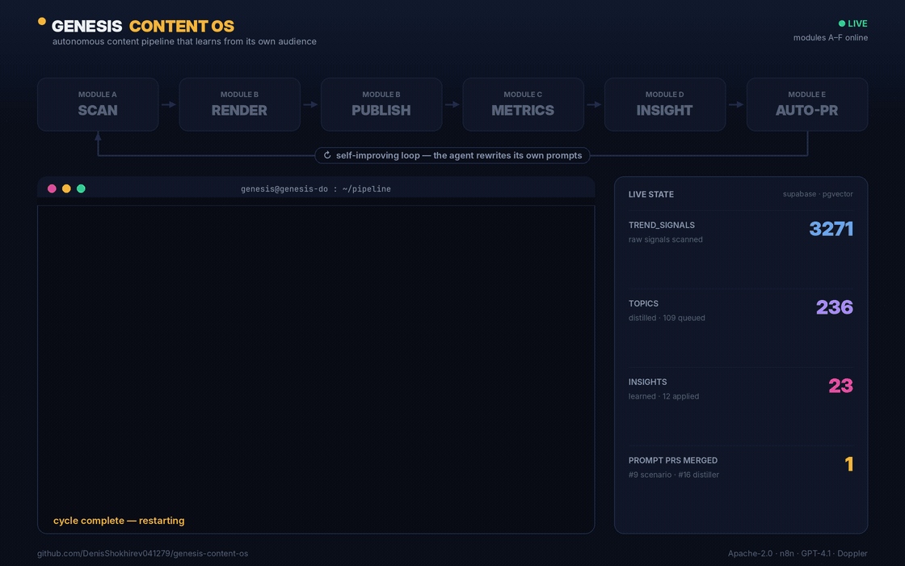
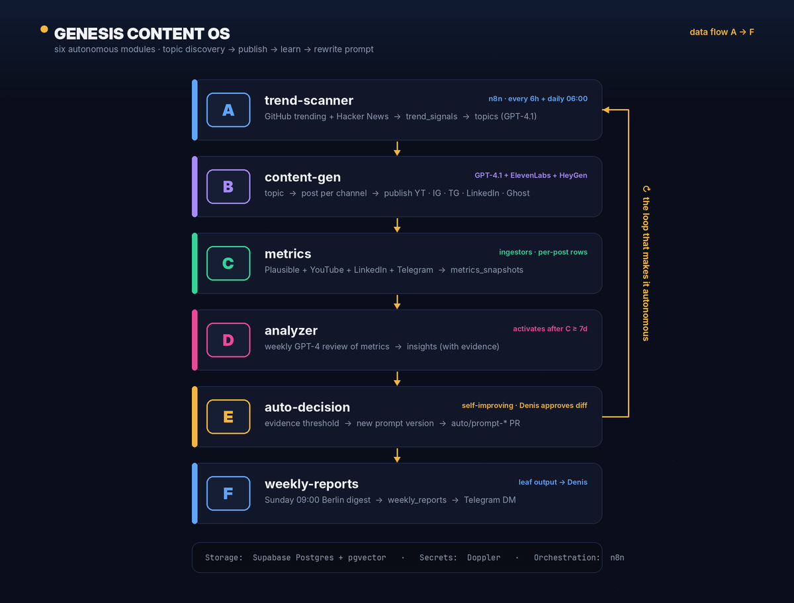
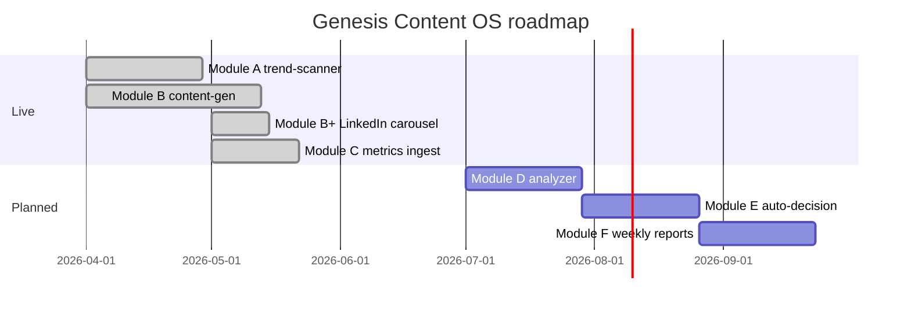

# Genesis Content OS

> **Autonomous AI content engine — scans trends, generates posts and videos, publishes to 5 channels, learns from metrics.**

[](https://opensource.org/licenses/Apache-2.0)
[](https://github.com/DenisShokhirev041279/genesis-content-os/stargazers)
[](https://github.com/DenisShokhirev041279/genesis-content-os/commits)
[](#license)

<p align="center">
  
</p>

<p align="center"><b>An open-source agent that analyzes its own audience and opens PRs to rewrite its own prompts.</b><br><a href="https://gerdennisai.com/genesis/">▶ live dashboard</a> · <a href="#architecture">architecture</a></p>


Genesis Content OS scans daily AI/dev news (GitHub trending, Hacker News, Reddit), distills the strongest signals into ranked topics with GPT-4.1, generates posts for **5 channels** (Ghost RU, Ghost EN, Telegram, LinkedIn, YouTube Shorts), publishes them on schedule, and reads its own engagement metrics back to tune what it writes next.

Voice-cloned audio (ElevenLabs) and avatar video (HeyGen) are produced from the same topic record. From topic discovery to a live post on every channel takes about 3 days.

**Live output:**
- 📝 Blog: [gerdennisai.com/blog](https://gerdennisai.com/blog) — auto-published EN + RU
- 📱 Telegram: [@ger_dennis_ai](https://t.me/ger_dennis_ai) — daily AI signals
- 💼 LinkedIn: [linkedin.com/in/denis-shokhirev-38b866392](https://linkedin.com/in/denis-shokhirev-38b866392) — weekly carousel deep-dives
- 🎬 YouTube: Shorts on autonomous-systems topics

---

## Why this exists

Most "AI content automation" stacks are LLM wrappers around Buffer or Hootsuite — schedule and forget. They don't *learn*.

Genesis OS is built on three convictions:
1. **Content quality is a feedback loop, not a single shot.** A pipeline that doesn't read its own metrics will plateau at mediocre.
2. **Context engineering > prompt engineering.** Five layers — identity, project memory, task memory, retrieved context, runtime scaffolding. Most stacks do layer 4.
3. **Single source of truth for one topic across channels.** One `topic` row produces a Ghost post, a TG announcement, a LinkedIn carousel, and a YouTube Short — all coherent, all from the same `topic_id`.

The point is **Module E**: the system reads its own performance and rewrites its own prompts. The human (you) only approves the diff.

---

## Architecture

<p align="center">
  
</p>


```
┌──────────────────────────────────────────────────────────────────┐
│                Trend Sources (GitHub, Hacker News, Reddit)       │
└───────────────────────────────┬──────────────────────────────────┘
                                │
                  ┌─────────────▼──────────────┐
                  │  Module A: trend-scanner   │   every 6h
                  │  → trend_signals (raw)     │   distiller daily 06:00 Berlin
                  │  → topics (distilled)      │
                  └─────────────┬──────────────┘
                                │
                  ┌─────────────▼──────────────┐
                  │  Module B: content-gen     │   GPT-4.1
                  │  topic → post per channel  │   ElevenLabs voice clone
                  │  → posts                   │   HeyGen avatar render
                  └─────────────┬──────────────┘
                                │
        ┌──────────────┬────────┼─────────┬──────────────┐
        │              │        │         │              │
   ┌────▼─────┐ ┌──────▼──┐ ┌───▼──┐ ┌────▼─────┐ ┌─────▼──────┐
   │ Ghost RU │ │ Ghost EN│ │  TG  │ │ LinkedIn │ │   YouTube  │
   │   blog   │ │   blog  │ │  ann │ │ carousel │ │   Shorts   │
   └──────────┘ └─────────┘ └──────┘ └──────────┘ └────────────┘

                  ┌─────────────▼──────────────┐
                  │  Module C: metrics ingest  │   every 6h
                  │  → metrics_snapshots       │   Plausible + platform APIs
                  └─────────────┬──────────────┘
                                │
                  ┌─────────────▼──────────────┐
                  │  Module D: analyzer        │   GPT-4.1 weekly review
                  │  → insights (with evidence)│
                  └─────────────┬──────────────┘
                                │
                  ┌─────────────▼──────────────┐
                  │  Module E: auto-decision   │   prompt-version bump
                  │  → prompts (new version)   │   on evidence threshold
                  └─────────────┬──────────────┘   ⬅ THE INTERESTING PART
                                │
                  ┌─────────────▼──────────────┐
                  │  Module F: weekly-reports  │
                  │  → weekly_reports          │
                  └────────────────────────────┘
```

**Storage:** Supabase Postgres + pgvector (7 tables, 2 views, 1 mat. view)
**Secrets:** Doppler (10+ secrets, dev/prod configs)
**Workflows:** n8n (HTTP Request nodes against Supabase REST)
**Analytics:** Plausible Cloud (privacy-first, no cookies)

---

## Modules

| Module | Purpose | Status |
|---|---|---|
| **A — trend-scanner** | GitHub trending + HN top → `trend_signals` → distilled `topics` | live |
| **B — content-gen** | Topic → post per channel, voice + avatar render | live |
| **B+ — LinkedIn carousel** | PDF carousels via ReportLab (style: a16z deck, not SaaS marketing) | live (manual approval gate via Telegram) |
| **C — metrics** | Pull engagement from Ghost / TG / LinkedIn / YT into `metrics_snapshots` | live |
| **D — analyzer** | Weekly GPT-4.1 review → `insights` with evidence | planned (2026-Q3) |
| **E — auto-decision** | Apply approved insights as new prompt versions | planned (2026-Q3) |
| **F — weekly-reports** | Generate `weekly_reports` markdown digest | planned (2026-Q4) |

Module E is where Genesis becomes autonomous. It reads its own performance, identifies what worked, drafts a new prompt version, and **asks the human to approve the diff** — not the post, the prompt itself. The human becomes a trainer, not an author.

---

## What's interesting about it

### 1. One row, every channel

```sql
SELECT id, slug_en, title_ru, title_en, topic_category, hype_score, status
FROM topics
WHERE id = '6867357e-1d86-4b66-860b-87321a676820';
```

This single row produces:
- Ghost RU post (via Admin API, JWT)
- Ghost EN post (same)
- Telegram channel announce (with both URLs)
- LinkedIn carousel PDF (11 slides, ReportLab) — `B+` module
- LinkedIn text post (caption above carousel)
- YouTube Short script

All channels reference back to the topic. When metrics arrive, they're attributed to this `topic_id` automatically.

### 2. The Apache-2.0 patent grant

This project builds on workflow patterns covered by **Rospatent software patent #2025612789** (NextGen Pathways, by Denis Shokhirev). Apache-2.0 explicitly grants contributors and users a **patent license under that patent**.

If you fork, build on, or commercialize Genesis OS — you have a written patent license for the underlying patterns. No surprise C&D letters. This is the entire point of choosing Apache-2.0 over MIT for patent-encumbered software.

### 3. Telegram approval gate for high-stakes channels

Some channels (LinkedIn for B2B audience) shouldn't publish without human eyes. The carousel pipeline:

1. Cron generates PDF + caption.
2. Sends to Denis on Telegram with **inline keyboard** `✅ Publish` / `❌ Skip`.
3. A `systemd` service polls Telegram callbacks, runs the LinkedIn Document Post API on `✅`.

This pattern composes — any module can route through TG approval before going public.

---

## Comparison with alternatives

| | Buffer + Zapier | Hootsuite + Claude | Postiz | **Genesis OS** |
|---|---|---|---|---|
| Open source | ❌ | ❌ | ✅ MIT | ✅ Apache-2.0 |
| Self-hostable | ❌ | ❌ | ✅ | ✅ |
| Generates content (not just schedules) | partial | ✅ | partial | ✅ |
| Multi-channel from single source | ❌ | ❌ | ✅ | ✅ |
| Voice clone + avatar video | ❌ | ❌ | ❌ | ✅ |
| LinkedIn Document Posts (carousels) | ❌ | ❌ | ❌ | ✅ |
| Reads own metrics | ❌ | ❌ | partial | ✅ |
| **Auto-tunes prompts from metrics** | ❌ | ❌ | ❌ | ✅ (Module E) |
| Patent grant | n/a | n/a | ❌ | ✅ |

---

## Quickstart

Local development from a clean clone:

```bash
git clone https://github.com/DenisShokhirev041279/genesis-content-os.git
cd genesis-content-os
```

1. **Provision Supabase** (free tier is enough — Frankfurt region or your nearest)
   - SQL Editor → run `sql/001_initial_schema.sql`. You get 7 tables, 2 views, 1 materialized view, 5 seeded prompts.
   - Copy Project URL and `service_role` key.

2. **Set up Doppler**
   - Project: `genesis-content-os`. Configs: `dev`, `prod`.
   - Secrets: `OPENAI_API_KEY`, `SUPABASE_URL`, `SUPABASE_SERVICE_KEY`, `GHOST_ADMIN_KEY`, `TELEGRAM_BOT_TOKEN`, `LINKEDIN_TOKEN`, `LINKEDIN_PERSON_URN`, `ELEVENLABS_API_KEY`, `HEYGEN_API_KEY`, `PLAUSIBLE_TOKEN`, `N8N_API_KEY`.

3. **Import n8n workflows**
   - Self-host n8n or use n8n Cloud.
   - Import all JSON from `workflows/` (Modules A, B, C live).
   - Create one HTTP credential `supabase_genesis` with header `apikey: <service_key>`.

4. **Trigger a manual run**
   ```bash
   doppler run -- node scripts/trigger.js trend-scanner
   ```
   Watch `trend_signals` populate. Distiller fires next at 06:00 Berlin.

See [docs/SETUP.md](docs/SETUP.md) for full guide including LinkedIn OAuth, Ghost Admin key generation, and HeyGen avatar setup.

---

## Stack

`Supabase Postgres` · `pgvector` · `n8n` · `Doppler` · `OpenAI GPT-4.1` · `OpenAI text-embedding-3-small` · `ElevenLabs voice clone` · `HeyGen avatar` · `Ghost CMS` · `LinkedIn Posts API v2` · `Telegram Bot API` · `YouTube Data API v3` · `Plausible Analytics` · `Python 3.12` · `TypeScript` · `ReportLab` · `ffmpeg`

---

## Roadmap



---

## License

Apache License 2.0 — see [LICENSE](LICENSE).

The Apache-2.0 patent grant matters here: Genesis builds on workflow patterns covered by **Rospatent software patent #2025612789** (NextGen Pathways). Apache-2.0 explicitly grants contributors and users a patent license under that patent, so the project stays freely usable.

---

## Contributing

Modules **C through F** are first-class issues for new contributors. See [CONTRIBUTING.md](CONTRIBUTING.md).

If you ship something interesting on top of Genesis OS — open a PR linking your repo. We'll feature good ones in the README.

---

## Author

**Denis Shokhirev** — Enterprise AI architect, founder of [DennisCraft AI Studio](https://gerdennisai.com) (Erlangen, Germany).

- Site: [gerdennisai.com](https://gerdennisai.com)
- Patent: Rospatent software patent #2025612789 (NextGen Pathways)
- LinkedIn: [linkedin.com/in/denis-shokhirev-38b866392](https://linkedin.com/in/denis-shokhirev-38b866392)
- Telegram: [@ger_dennis_ai](https://t.me/ger_dennis_ai) (channel)

---

## Status

**Active development.** Modules A, B, B+, C live in production publishing daily content for [@ger_dennis_ai](https://t.me/ger_dennis_ai).

Open to contributors — see issues tagged `good-first-issue` for entry points.
